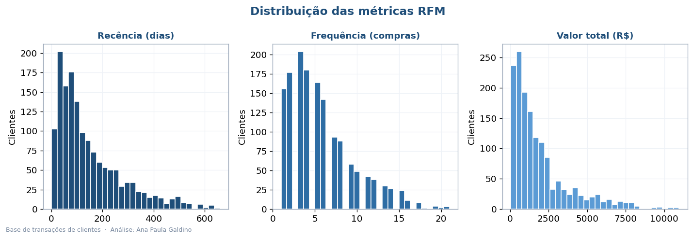
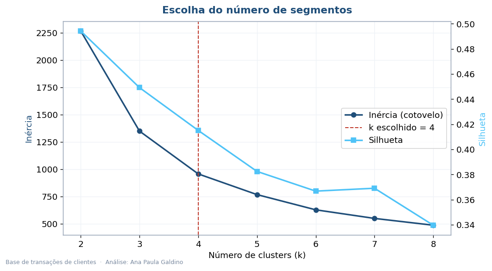
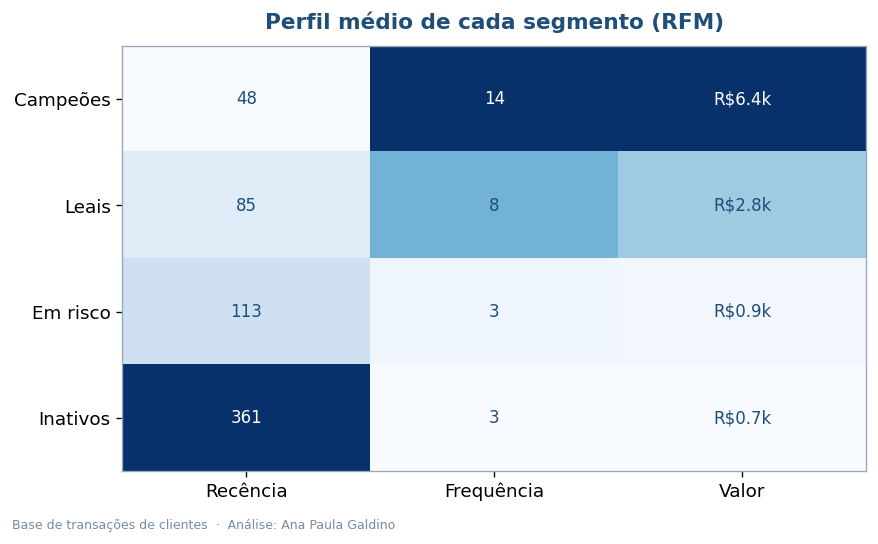
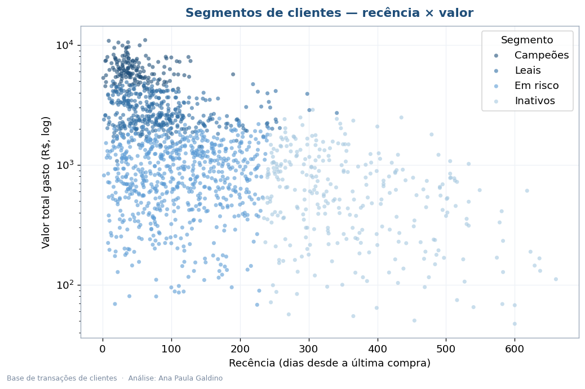
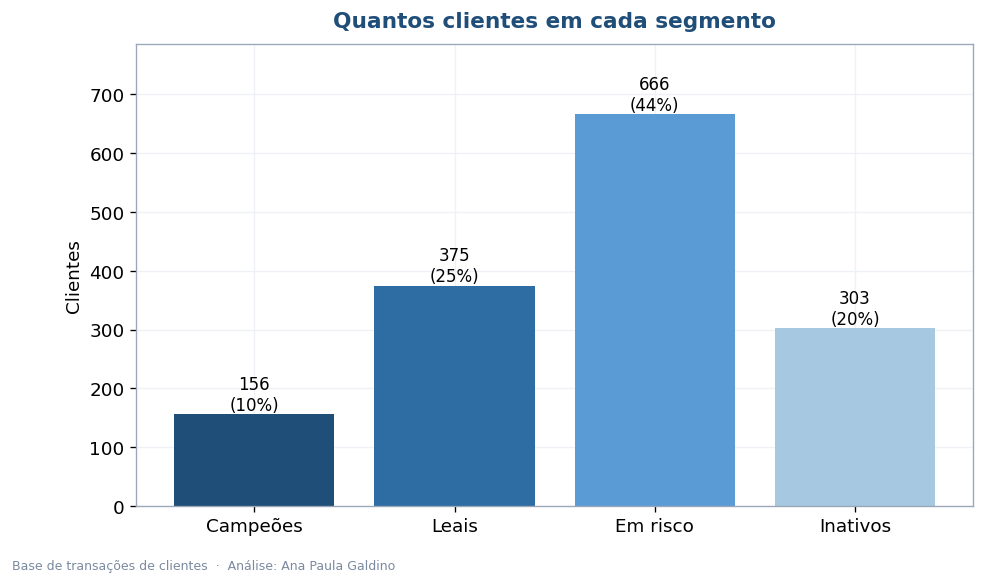
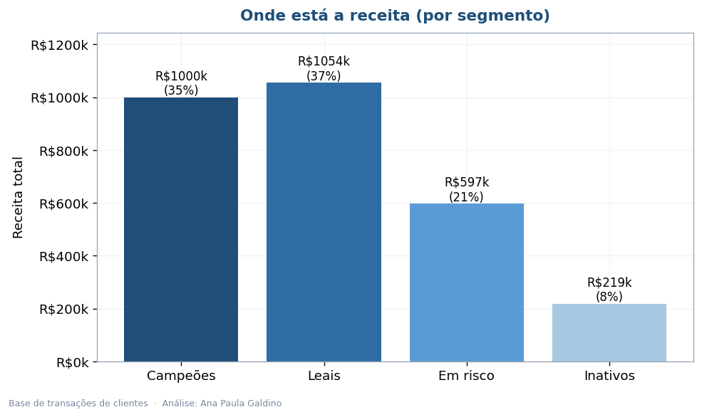

# Segmentação de Clientes com RFM + K-Means

Tratar todo cliente igual é desperdício. Este projeto agrupa os clientes pelo que eles
realmente fazem — quando compraram, com que frequência e quanto gastaram — e transforma isso
em segmentos com nome e ação. A técnica é o RFM combinado com K-Means.

**[Ler o relatório executivo (PDF)](Analise_Executiva_Segmentacao.pdf)**

## A ideia

RFM resume cada cliente em três números:

- **Recência** — há quanto tempo fez a última compra
- **Frequência** — quantas vezes comprou
- **Valor** — quanto gastou no total

Com esses três eixos, o K-Means encontra grupos naturais. Eu nomeei cada grupo pelo perfil:
**Campeões, Leais, Em risco e Inativos**.

## O que descobri

| | |
|---|---|
| Clientes analisados | 1.500 |
| Segmentos | 4 (definidos por cotovelo + silhueta) |
| Receita concentrada nos Campeões | ~35% (com só ~10% dos clientes) |
| Clientes em risco ou inativos | ~65% |

A leitura é direta: um grupo pequeno de Campeões sustenta a maior parte da receita, enquanto
a maioria da base precisa de reativação. Cada segmento pede uma ação diferente.

## As visualizações

| | |
|---|---|
|  |  |
|  |  |
|  |  |

## Tecnologias

Python 3.10+, pandas, scikit-learn (K-Means, StandardScaler, silhueta), matplotlib e reportlab.

## Organização

```
segmentacao-clientes-rfm/
├── README.md
├── Analise_Executiva_Segmentacao.pdf
├── requirements.txt
├── dados/transacoes.csv
├── src/
│   ├── gerar_dados.py         # monta as transações
│   ├── segmentacao_rfm.py     # calcula RFM, agrupa e gera os 6 gráficos
│   └── gerar_relatorio.py     # monta o PDF
└── imagens/
```

```bash
pip install -r requirements.txt
python src/gerar_dados.py
python src/segmentacao_rfm.py
python src/gerar_relatorio.py
```

## Sobre os dados

As transações (1.500 clientes, ~8,4 mil compras) foram geradas por mim com perfis de cliente
realistas, para os segmentos surgirem de forma natural. Para usar dados reais, basta um CSV com
`cliente_id`, `data_compra` e `valor`.

---

Ana Paula Galdino · Data Analytics (POSTECH/FIAP)
[GitHub](https://github.com/AnaPaula-Galdino) · [LinkedIn](https://linkedin.com/in/galdinoana/)
